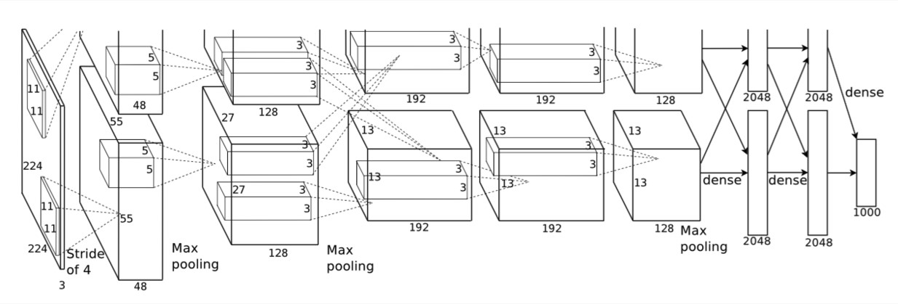
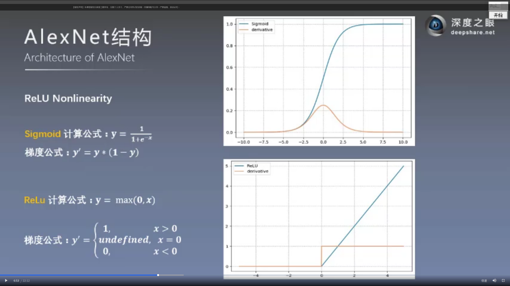

# ALexNet
## 网络

  
注意：全连接中“+1”指的是bias

## 激活函数
 
### ReLU Nonlinearity  
优点：  
1.使网络训练更快  
2.防止梯度消失  
3.使网络具有稀疏性   
4.不需要输入进行标准化来防止饱和现象，sigmod/tanh则必须要标准化

### Local Response Normalization 局部相应归一化
为什么要引入LRN层？  
首先要引入一个神经生物学的概念：侧抑制（lateral inhibitio），即指被激活的神经元抑制相邻的神经元。归一化（normaliazation）的目的就是“抑制”,LRN就是借鉴这种侧抑制来实现局部抑制，尤其是我们使用RELU的时候，这种“侧抑制”很有效 ，因而在alexnet里使用有较好的效果。

归一化有什么好处？  
1.归一化有助于快速收敛；  
2.对局部神经元的活动创建竞争机制，使得其中响应比较大的值变得相对更大，并抑制其他反馈较小的神经元，增强了模型的泛化能力。

## droput
droput在inference时，需要对输出乘以droput系数