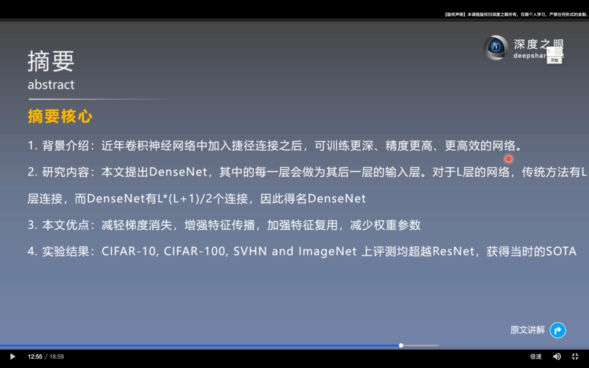
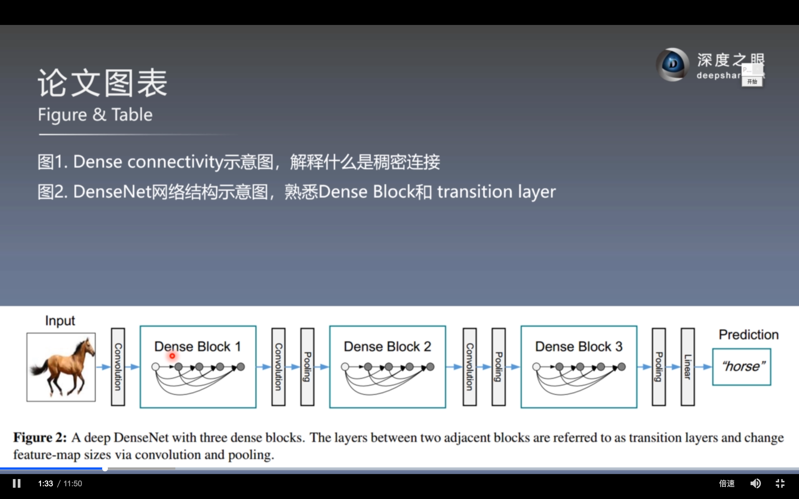
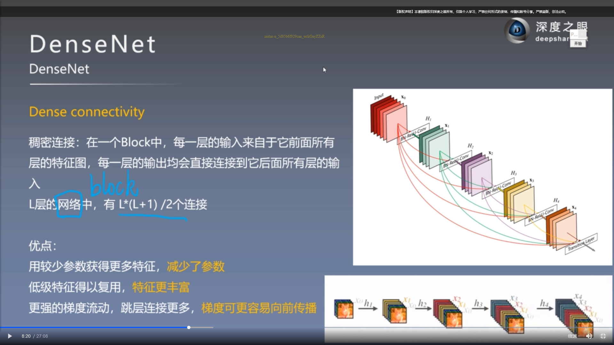
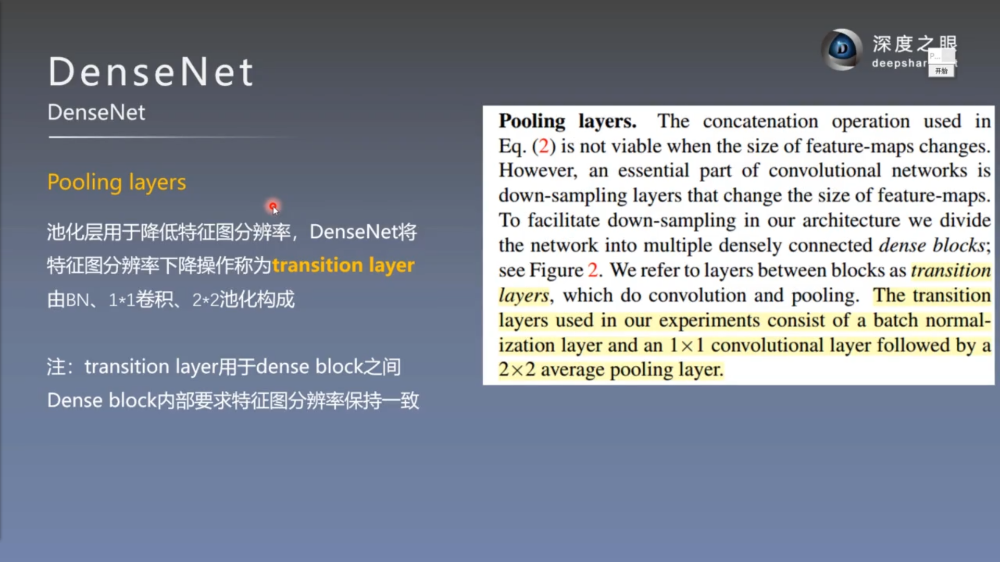
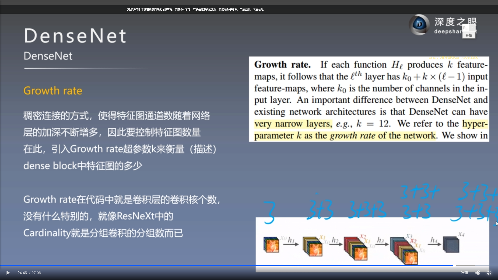
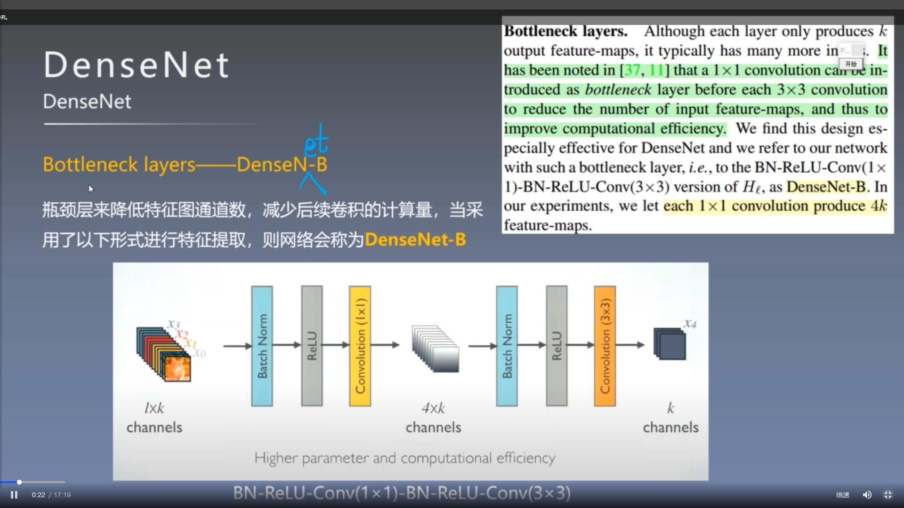
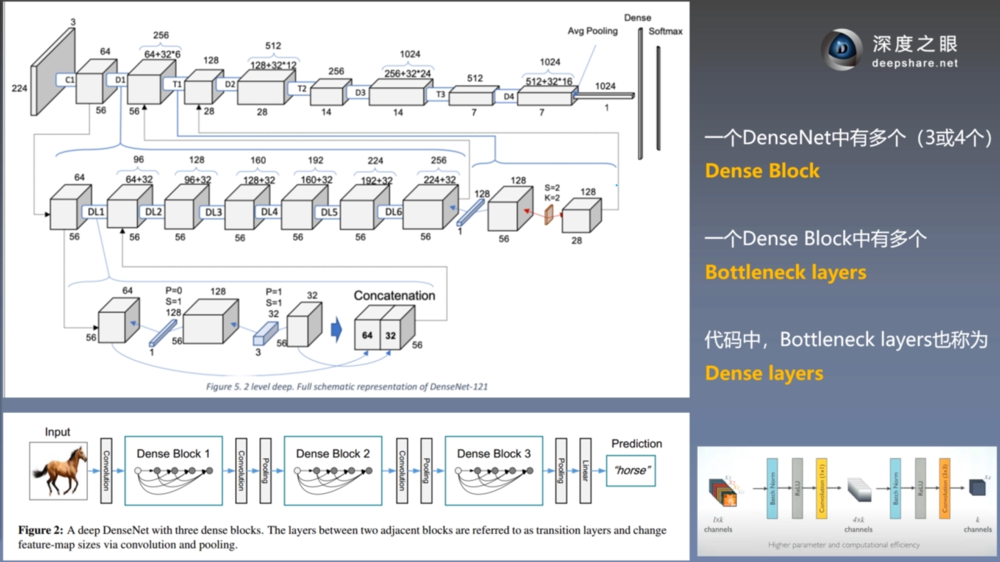
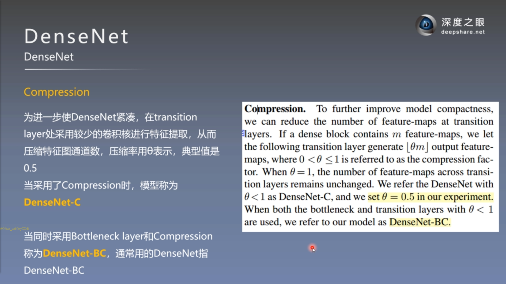
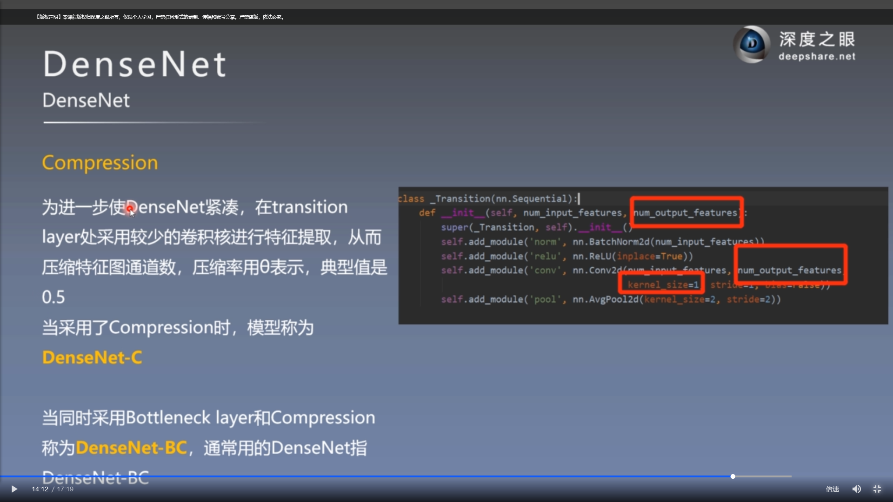

# DenseNet  

## *研究背景*  
**Short Paths**  

**多级特征复用 Feature Reuse**  
！ 无需额外运算  

**网络**
  
  
  
  
  
每个层仅有k个特征是自己独有的

  
Bottleneck
 layer作用是降低特征数量，从而提升计算效率 

  
  
  

综合来看，DenseNet的优势主要体现在以下几个方面：  
1. 由于密集连接方式，DenseNet提升了梯度的反向传播，使得网络更容易训练。由于每层可以直达最后的误差信号，实现了隐式的“deep supervision”；  
2. 参数更小且计算更高效，这有点违反直觉，由于DenseNet是通过concat特征来实现短路连接，实现了特征重用，并且采用较小的growth rate，每个层所独有的特征图是比较小的；  
3. 由于特征复用，最后的分类器使用了低级特征。
4. 减轻了vanishing-gradient（梯度消失）