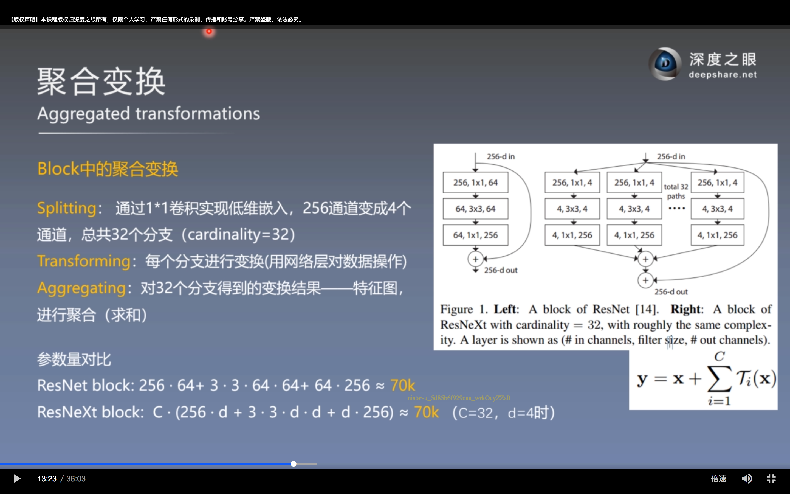
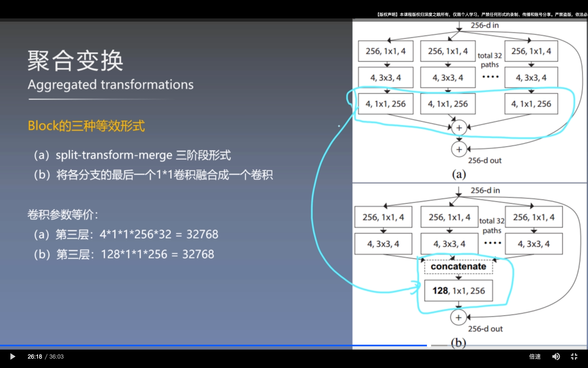
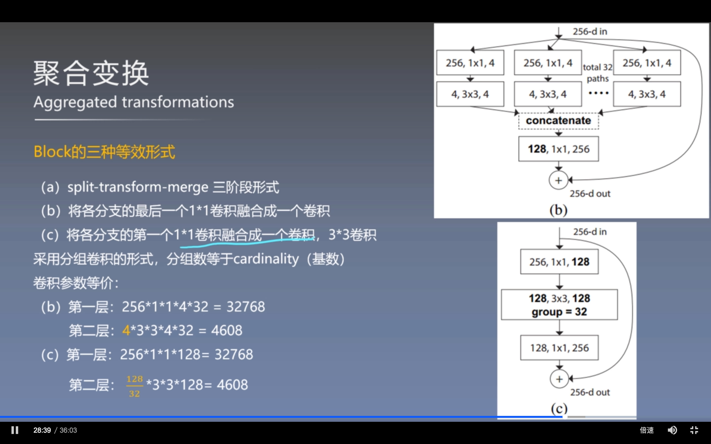
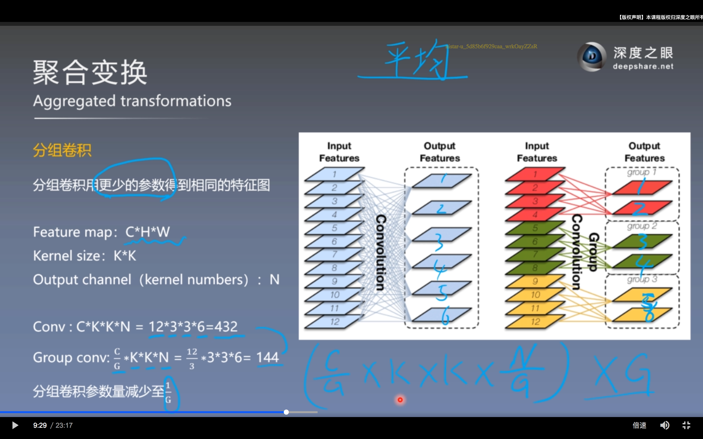
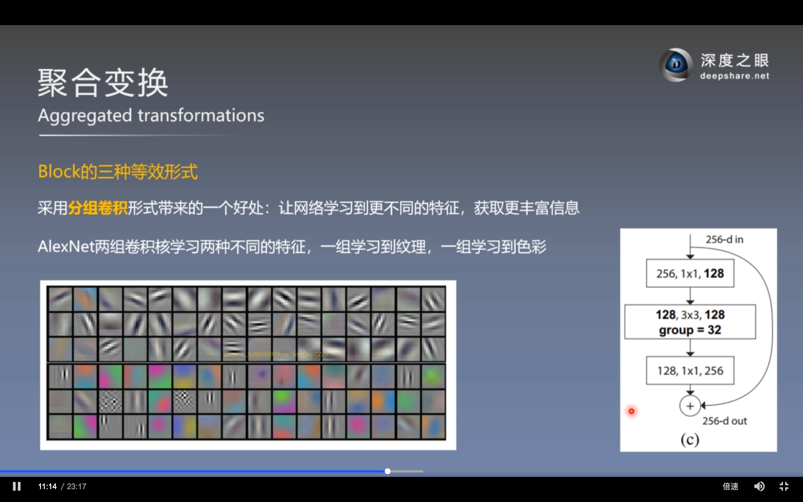
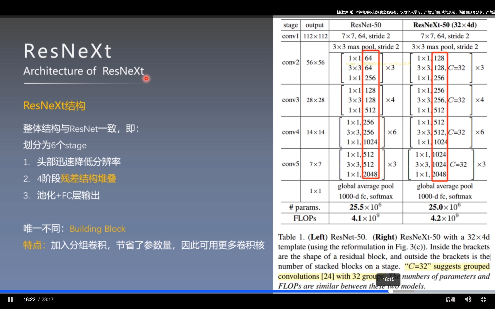
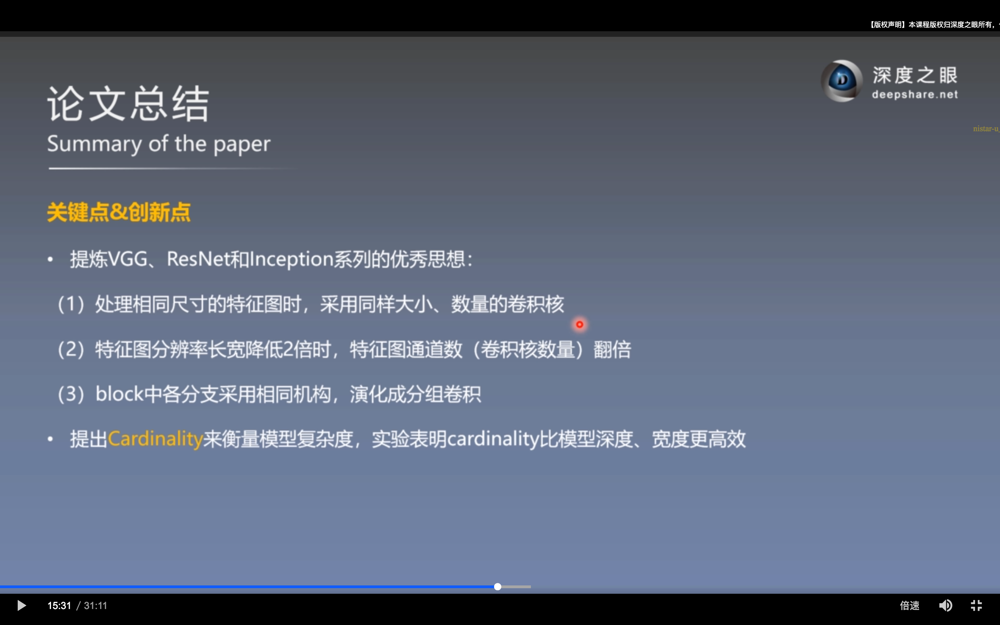

# ResNeXt

ResNeXt的本质是对ResNet进行分组卷积（Group Convolution），通过变量基数（Cardinality，也就是组数）来控制组的数量。

左图为resnet的残差单元，右图为ResNeXt的block，在保留残差结构的同时，对卷积层进行分组卷积。  

该block可以等效为下面两种结构

这三种block的参数量是完全一样的

## *分组卷积*

## *ResNeXt结构*

## *总结*

容易导致过拟合严重，需要大量数据集进行训练。  
