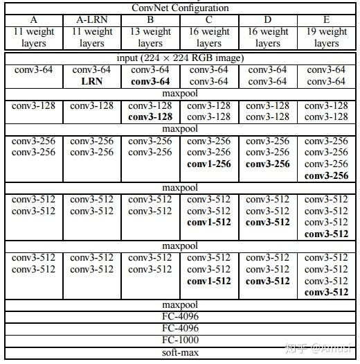
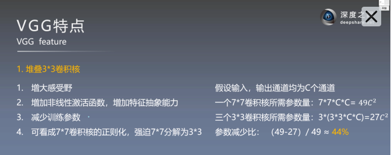

# VGG
## 网络

### VGG优缺点
VGG优点  
    VGGNet的结构非常简洁，整个网络都使用了同样大小的卷积核尺寸（3x3）和最大池化尺寸（2x2）。几个小滤波器（3x3）卷积层的组合比一个大滤波器（5x5或7x7）卷积层好：验证了通过不断加深网络结构可以提升性能。  

VGG缺点  
    VGG耗费更多计算资源，并且使用了更多的参数（这里不是3x3卷积的锅），导致更多的内存占用（140M）。其中绝大多数的参数都是来自于第一个全连接层。VGG可是有3个全连接层啊！  

PS：有的文章称：发现这些全连接层即使被去除，对于性能也没有什么影响，这样就显著降低了参数数量。  

### 为什么要使用许多小卷积核(如3x 3)  
1. 可以使用几个较小的核而不是几个较大的核来获得相同的感受野并捕获更多的空间上下文，但是使用较小的内核时，您使用的参数和计算量较少。（增大感受野）  
2. 其次，因为使用更小的核，您将使用更多的滤波器，您将能够使用更多的激活函数，从而使您的CNN学习到更具区分性的映射函数。 （增加非线性）

