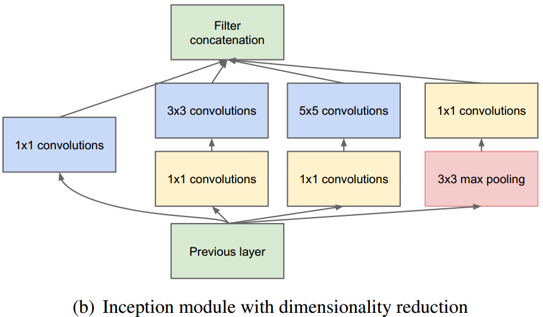
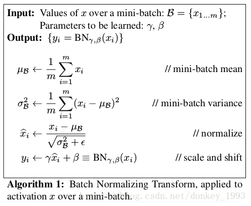
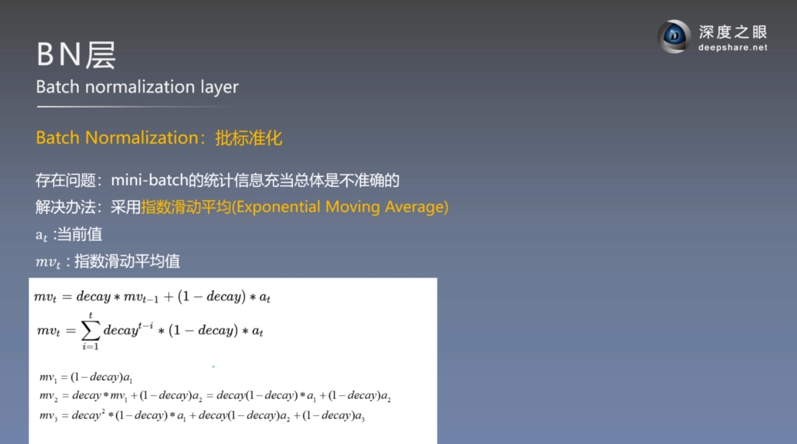
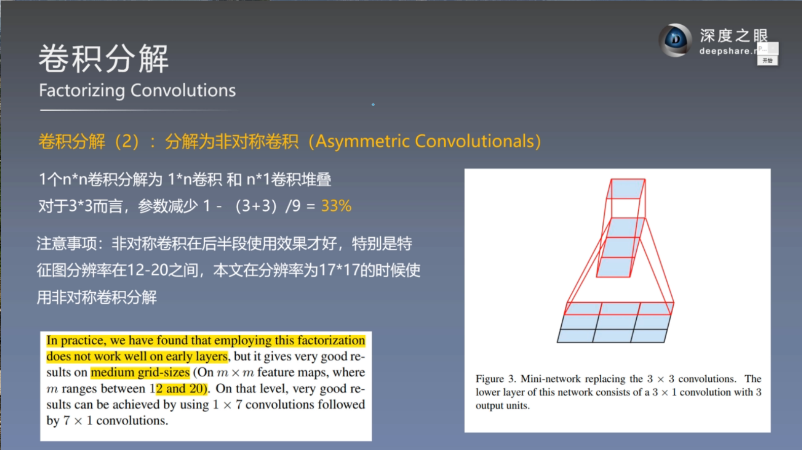
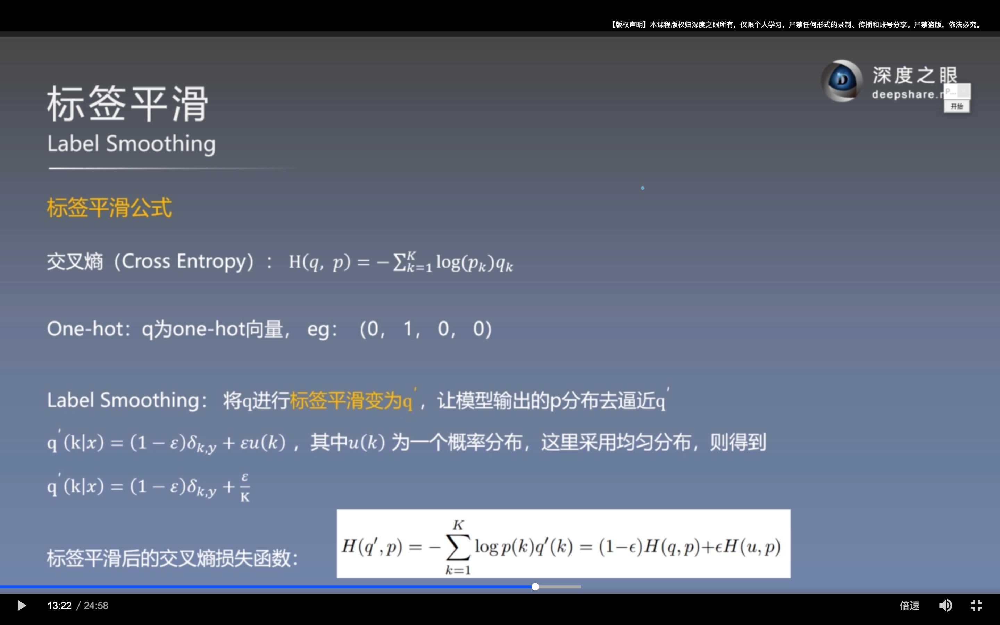
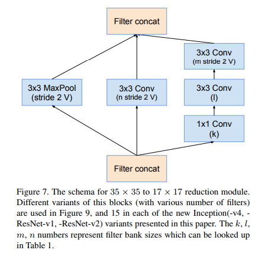

# GoogleNet V1 - inception

## *多尺度卷积*
1x1 conv，3x3 conv，5x5 conv，3x3 maxpooling的多尺度卷积融合  
3x3 maxpooling 可让特征图通道数增加，且用较少的计算量   
采用不同大小的卷积核意味着不同大小的感受野，最后拼接意味着不同尺度特征的融合  
网络越到后面，特征越抽象，而且每个特征所涉及的感受野也更大了，因此随着层数的增加，3x3和5x5卷积的比例也要增加。  

## *1x1卷积*
采用1x1卷积核来进行降维   
主要是两点作用：1）对数据进行降维/升维；2）引入更多的非线性，提高泛化能力

## *GAP，global average pooling*
在[AlexNet](../AlexNet/README.md)中已有说明  
用GAP替代FC全连接层。有两个优点：  
一是GAP在特征图与最终的分类间转换更加简单自然；  
二是不像FC层需要大量训练调优的参数，降低了空间参数会使模型更加健壮，抗过拟合效果更佳。  

## *辅助损失*  
1.增加loss回传  
2.使中间层特征也能具备分类能力  
工程已经很少用了，仅用于训练  

# GoogleNet V2

## *ICS(internal covariate shift)*  
ICS现象：输入数据分布变化，导致训练困难  

解决：白化 whitening，数据变成0均值，1标准差
对应的解决方法就是BN层，将卷积层的输出进行白化  

## *Batch Normalization*  
优点：  
1.加速训练  
2.正则  
3.可用饱和激活函数  
4.前向时，可以与卷积层合并，不额外消耗运算量  
5.可以加大学习率  

    
1.计算样本均值。  
2.计算样本方差。  
3.样本数据标准化处理。  
4.进行平移和缩放处理。引入了γ和β两个参数。来训练γ和β两个参数。引入了这个可学习重构参数γ、β，让我们的网络可以学习恢复出原始网络所要学习的特征分布。  

[深度学习—BN的理解（一）](https://www.cnblogs.com/eilearn/p/9780696.html)  
[BN原理与使用过程详解](https://blog.csdn.net/weixin_43937316/article/details/99573134)  
[BN(Batch Normalization) 原理与使用过程详解](https://blog.csdn.net/donkey_1993/article/details/81871132)  
[工程Trick | 合并BN层加速前向推理](https://www.jianshu.com/p/a940385921e3)  

后续发展：Layer Normalization（LN）、Instance Normalization（IN）、Group Normalization（GN）   

# GoogleNet V3
## *非对称卷积 Asymmetric Convolutionals*

## *标签平滑 Label Smoothing*  

# GoogleNet V4
加入残差结构

从左到右分别为Inception-v4中的 Inception Ａ、 Inception Ｂ、Inception Ｃ模块 

Inception-v4中的 Reduction模块