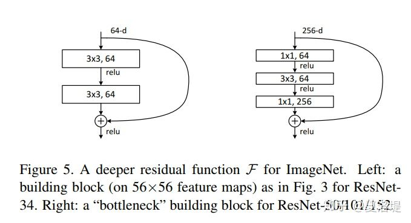
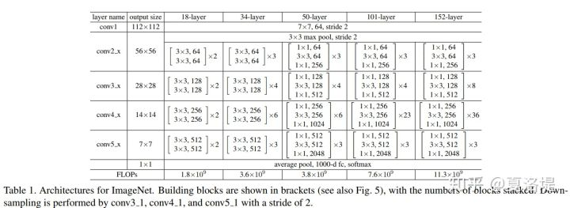

# ResNet

## *残差结构 Residual Unit*  
  
左为BasicBlock；右为BottleNeck Block  

就是为了降低参数的数目，第一个1x1的卷积把256维channel降到64维，然后在最后通过1x1卷积恢复，整体上用的参数数目：1x1x256x64 + 3x3x64x64 + 1x1x64x256 = 69632，而不使用bottleneck的话就是两个3x3x256的卷积，参数数目: 3x3x256x256x2 = 1179648，**差了16.94倍**  

通过在一个浅层网络基础上叠加 y=x 的层（称identity mappings，恒等映射），可以让网络随深度增加而不退化。

## *ResNet v1 结构*  

ResNet34和ResNet50参数量基本一致  

