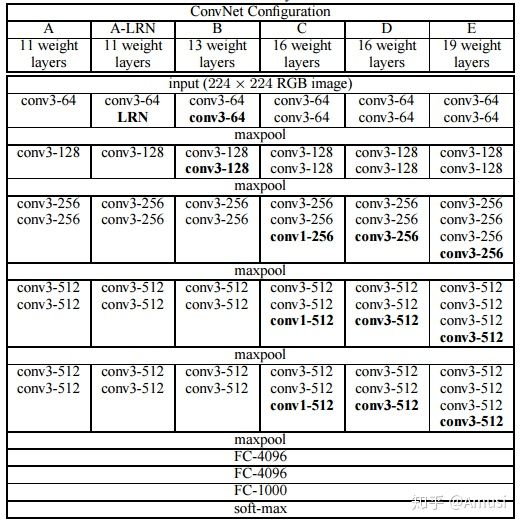
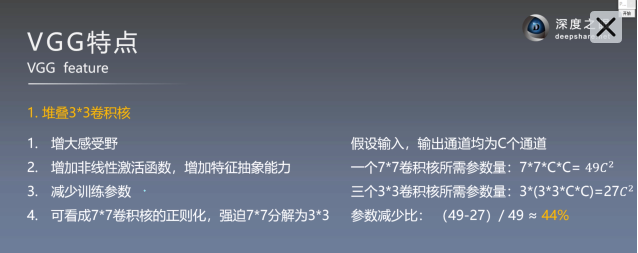

# VGG
## 网络

### VGG优缺点
VGG优点  
    VGGNet的结构非常简洁，整个网络都使用了同样大小的卷积核尺寸（3x3）和最大池化尺寸（2x2）。几个小滤波器（3x3）卷积层的组合比一个大滤波器（5x5或7x7）卷积层好：验证了通过不断加深网络结构可以提升性能。  

VGG缺点  
    VGG耗费更多计算资源，并且使用了更多的参数（这里不是3x3卷积的锅），导致更多的内存占用（140M）。其中绝大多数的参数都是来自于第一个全连接层。VGG可是有3个全连接层啊！  

PS：有的文章称：发现这些全连接层即使被去除，对于性能也没有什么影响，这样就显著降低了参数数量。  

### 为什么要使用许多小卷积核(如3x 3)  
1. 可以使用几个较小的核而不是几个较大的核来获得相同的感受野并捕获更多的空间上下文，但是使用较小的内核时，您使用的参数和计算量较少。（增大感受野）  
2. 其次，因为使用更小的核，您将使用更多的滤波器，您将能够使用更多的激活函数，从而使您的CNN学习到更具区分性的映射函数。 （增加非线性）

### Multi-scale训练 (scale jittering 尺度扰动)
首先对原始图片进行等比例缩放，使得短边要大于224，然后在图片上随机提取224x224窗口，进行训练。由于物体尺度变化多样，所以多尺度（Multi-scale）可以更好地识别物体。

方法1：在不同的尺度下，训练多个分类器：
参数S为短边长。训练S=256和S=384两个分类器，其中S=384的分类器用S=256的进行初始化，且将步长调为10e-3

方法2：直接训练一个分类器，每次数据输入的时候，每张图片被重新缩放，缩放的短边S随机从[256,512]中选择一个。