# FasterRCNN    

## RCNN
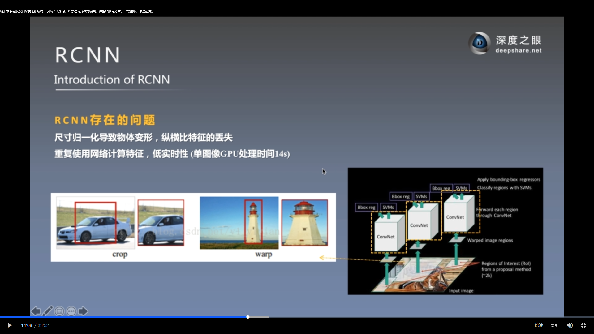  
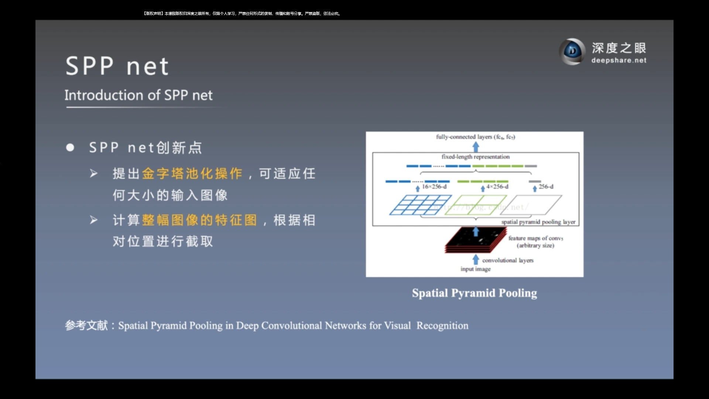  
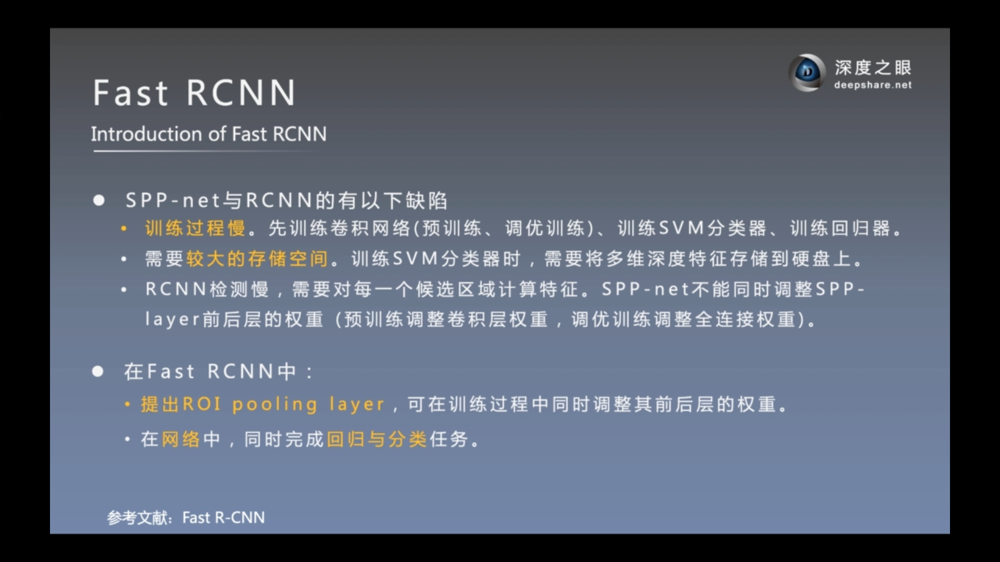  

 

## FasterRCNN 

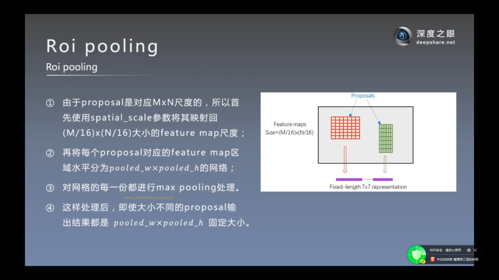 
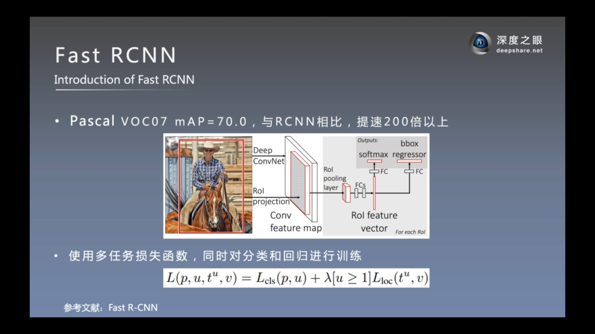  
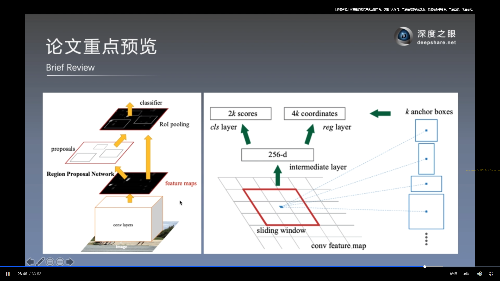 
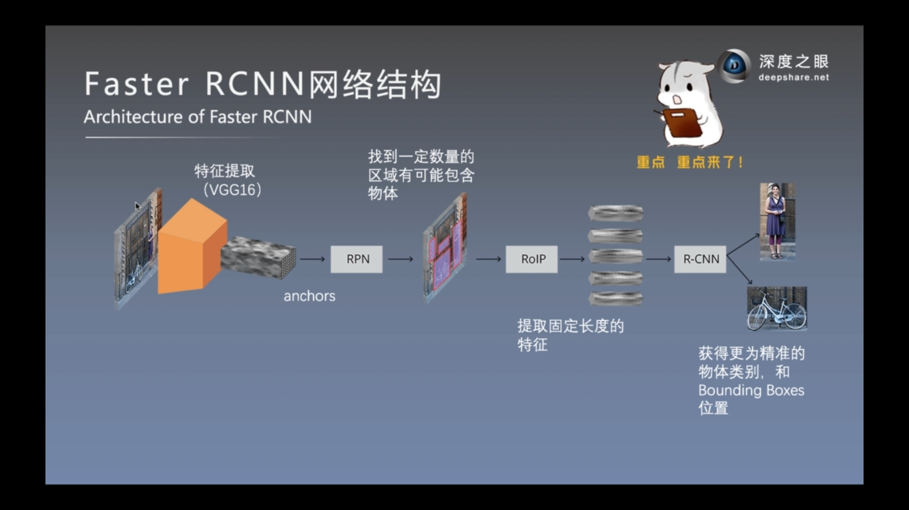  
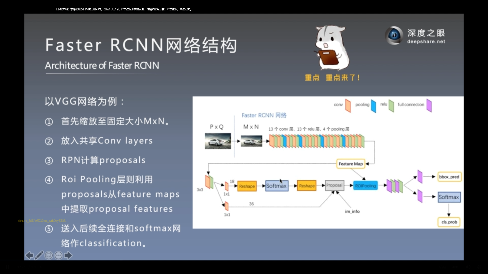 

Region Proposal Networks。RPN网络用于生成region proposals。该层通过softmax判断anchors属于positive或者negative，再利用bounding box regression修正anchors获得精确的proposals。
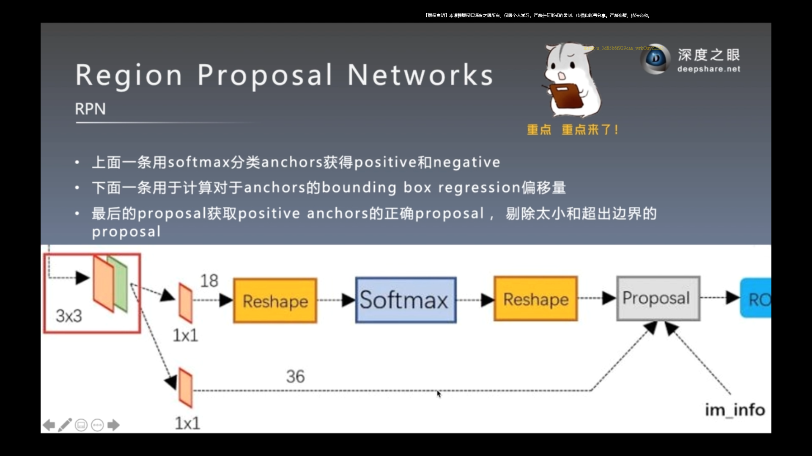 

Roi Pooling。该层收集输入的feature maps和proposals，综合这些信息后提取proposal feature maps，送入后续全连接层判定目标类别。
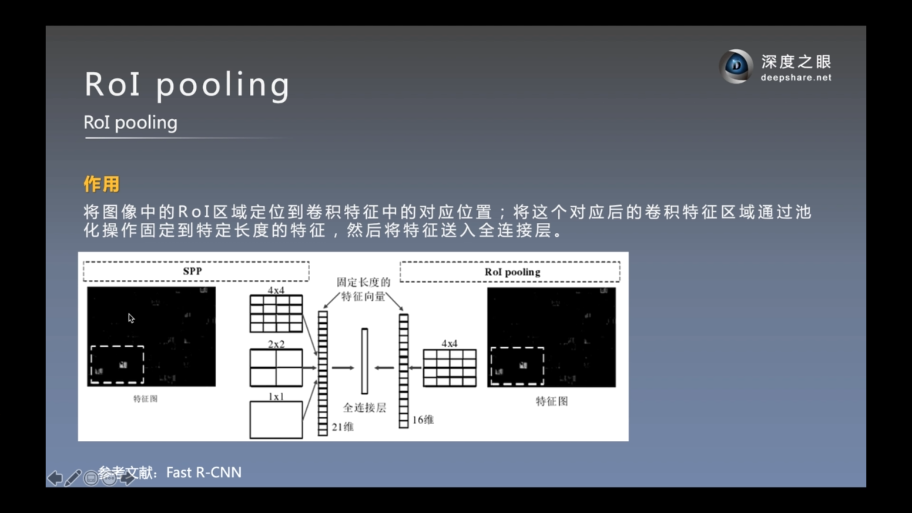 
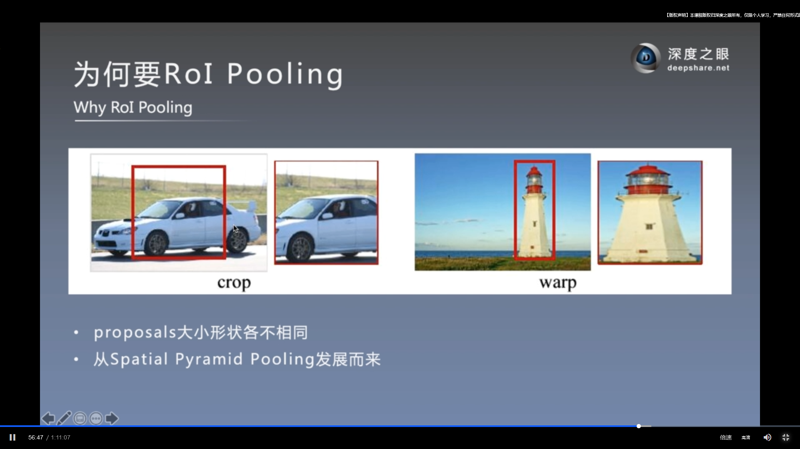

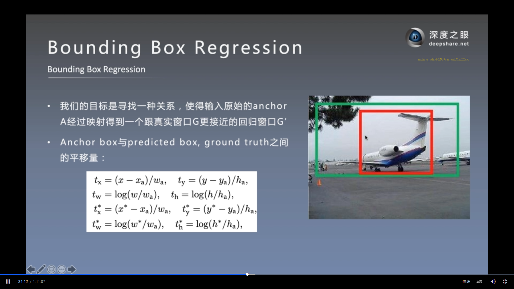  
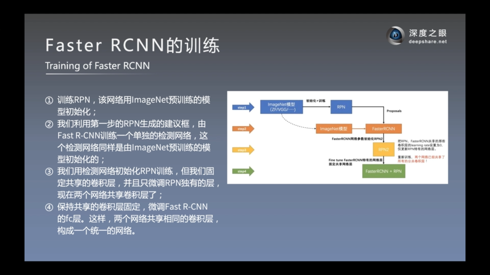 