# MobileNet  

## MobileNet结构  
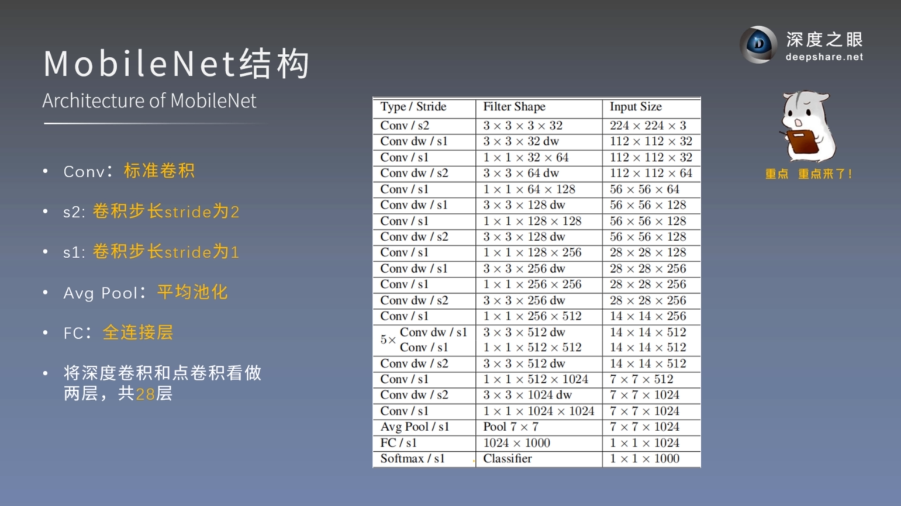  

## MobileNet Block  
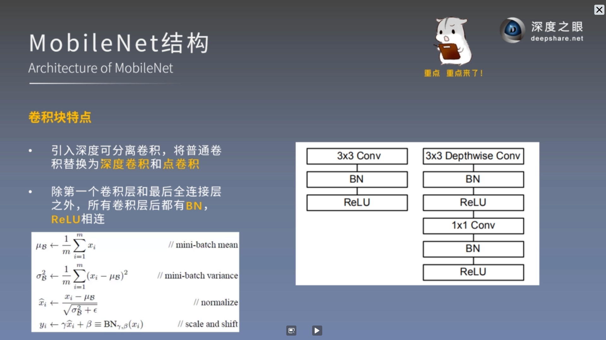 
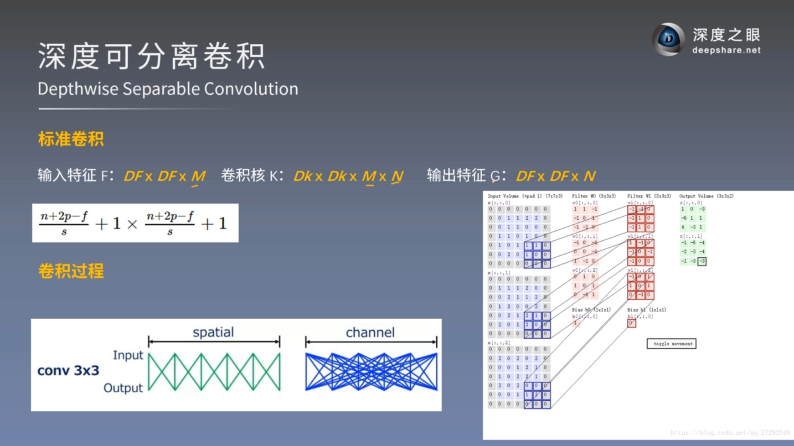 
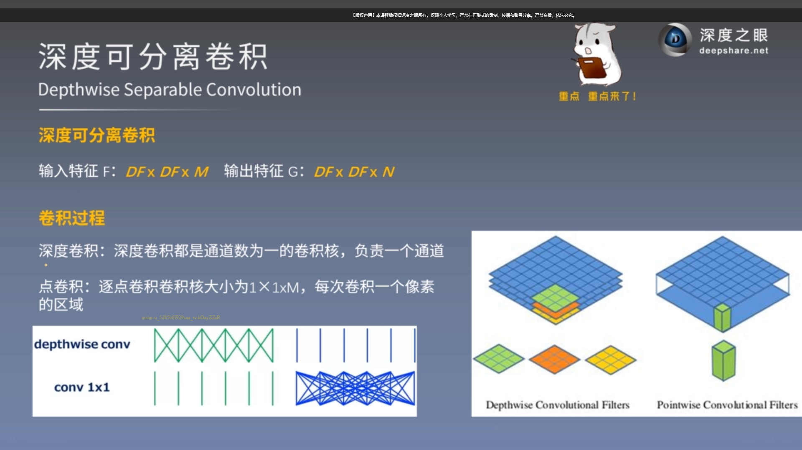 
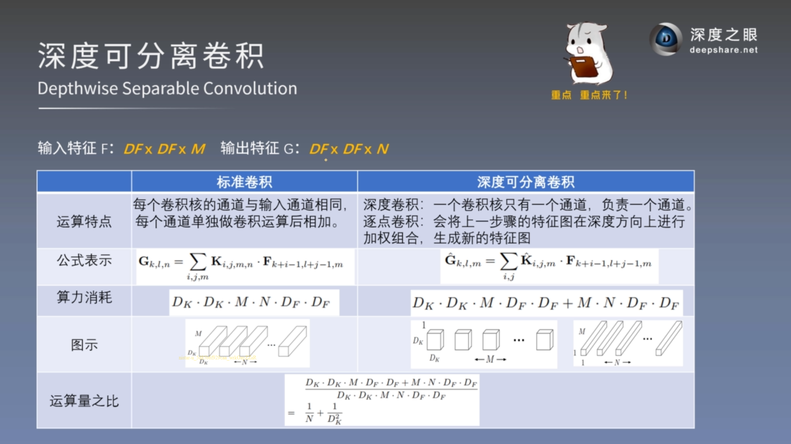 
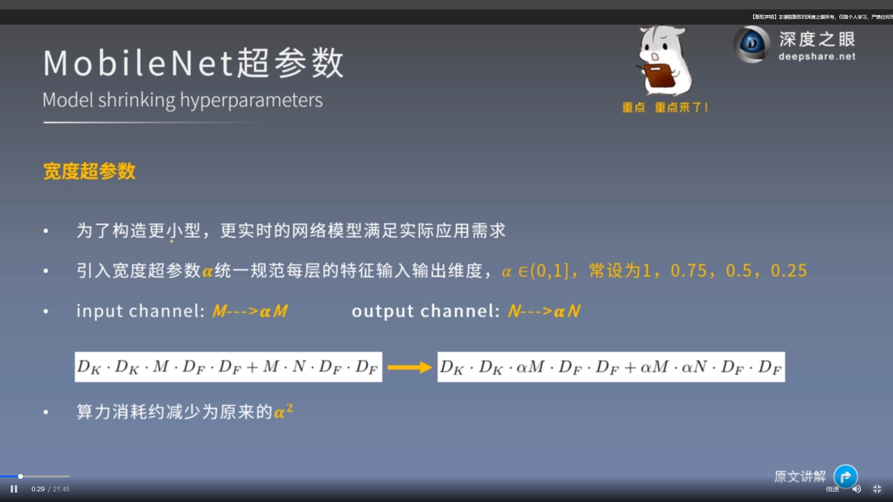 
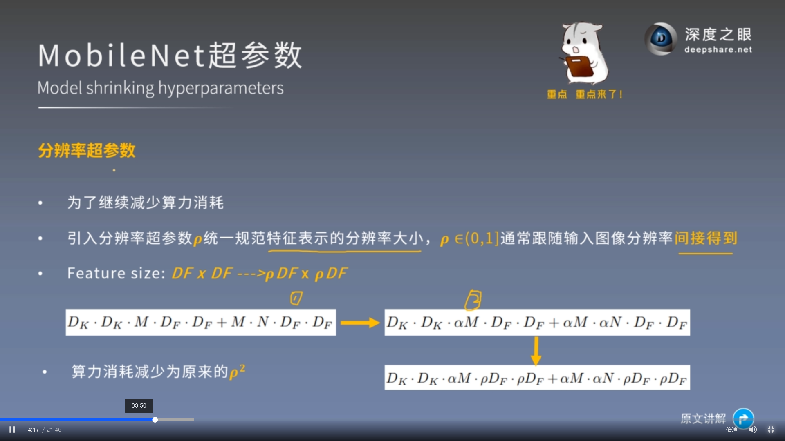 
[MobileNet 详解深度可分离卷积，它真的又好又快吗？](https://zhuanlan.zhihu.com/p/80177088)   
mobilenet并不一定快，内存交换量也比较大，具体是否实用需要看硬件平台  

## MobileNet v2/v3
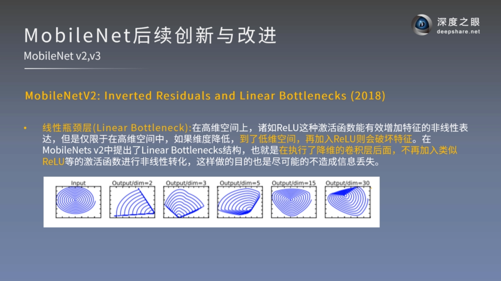 
Depthwise Convolution 的潜在问题：  
Depthwise Conv确实是大大降低了计算量， 而且NxN Depthwise + 1X1 PointWise的结构在性能上也能接近NxN Conv。 在实际使用的时候， 我们发现Depthwise 部分的kernel比较容易训废掉： 训完之后发现depthwise训出来的kernel有不少是空的...      
当时我们认为是因为depthwise每个kernel dim 相对于vanilla conv要小得多， 过小的kernel_dim， 加上ReLU的激活影响下， 使得神经元输出很容易变为0， 所以就学废了： ReLU对于0的输出的梯度为0， 所以一旦陷入了0输出， 就没法恢复了。 我们还发现，这个问题在定点化低精度训练的时候会进一步放大。  
在MobileNetV2中我们也看到了Google在这点上类似的解释， 用ReLu中 不同的Output/dim比值，对特征的分部空间可视化， 来直观解释特征/神经元退化问题。  
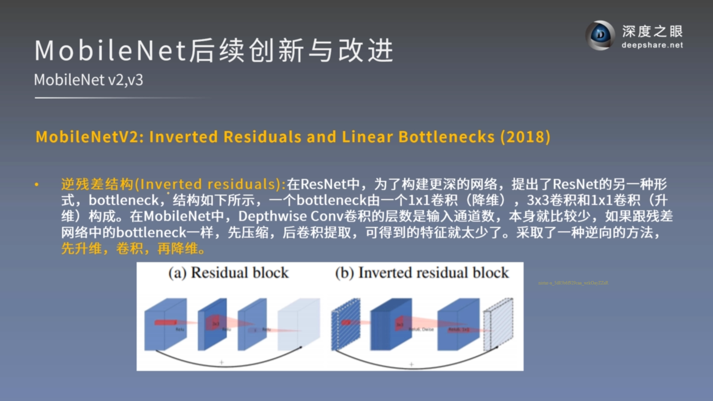  
缓解特征退化：Linear Bottleneck 通过去掉Eltwise+ 的特征去掉ReLU， 减少ReLU对特征的破坏； Invered residual 有两个好处： 1. 复用特征， 2. 旁支block内先通过1x1升维， 再接depthwise conv以及ReLU,  通过增加ReLU的InputDim， 来缓解特征的退化情况.
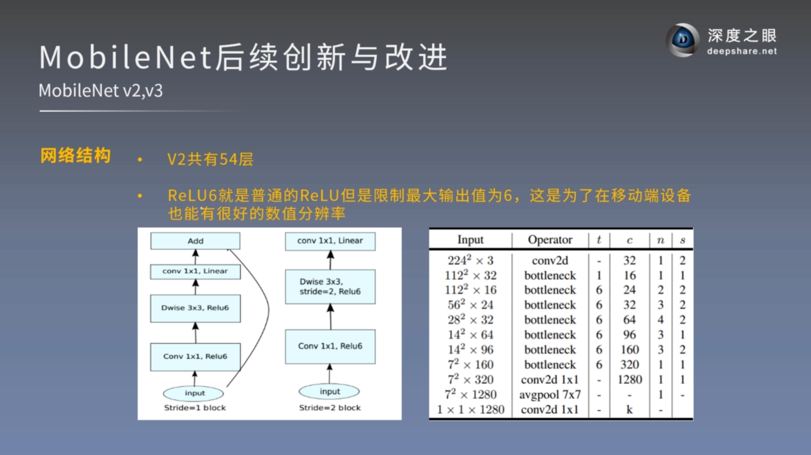 
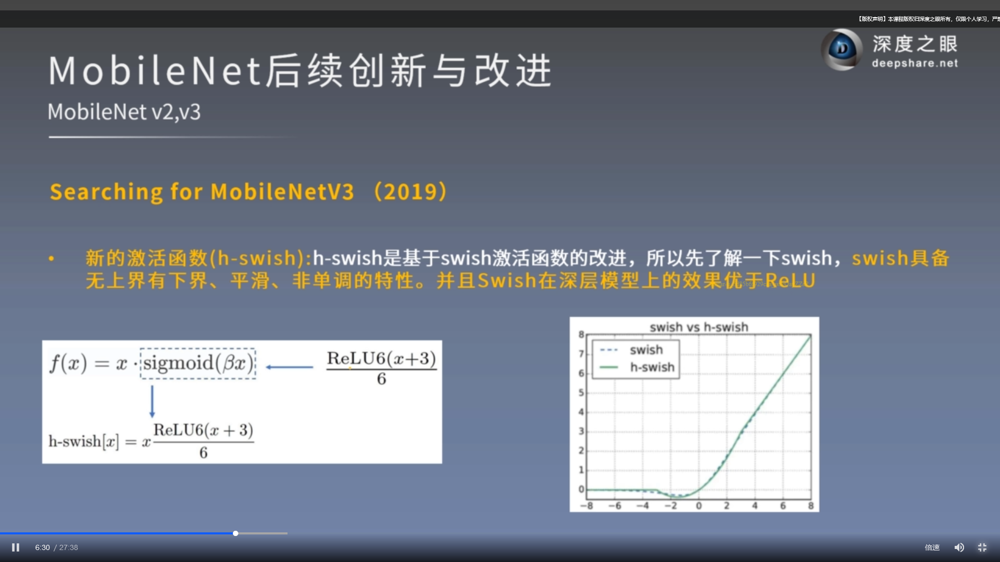 
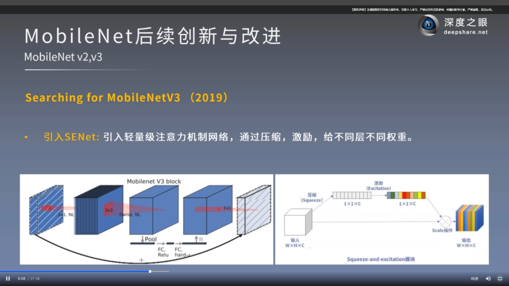 
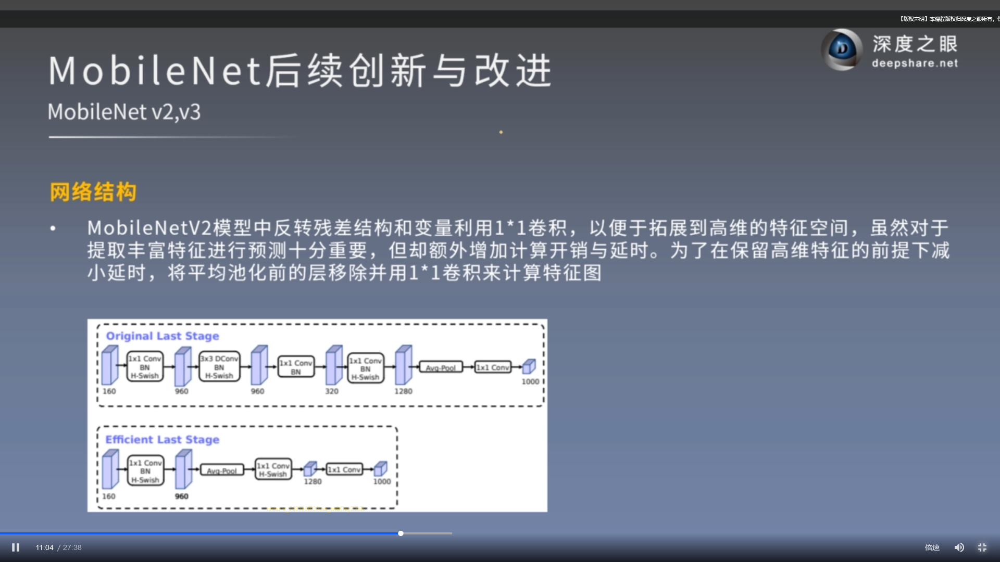 
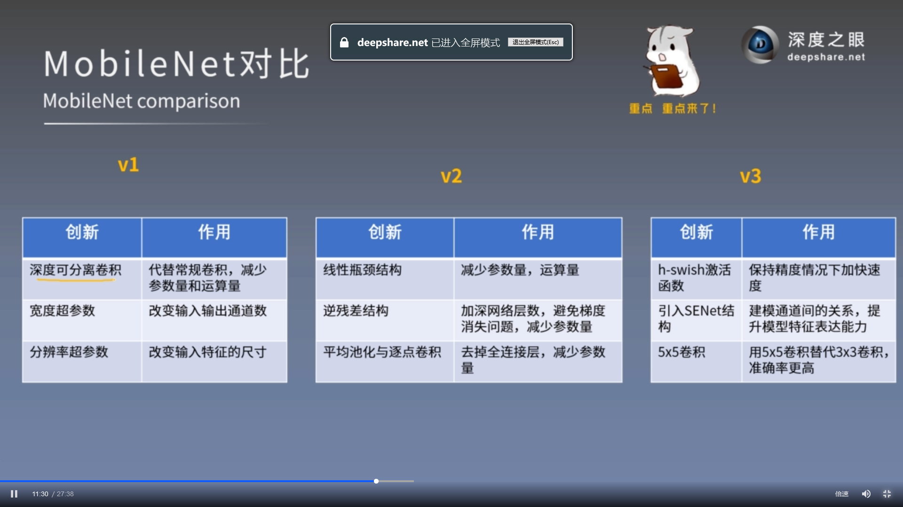 
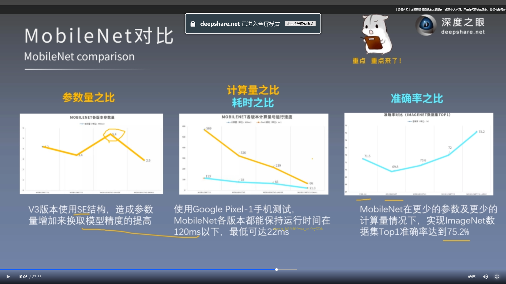 